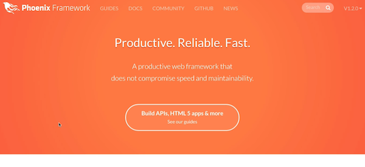
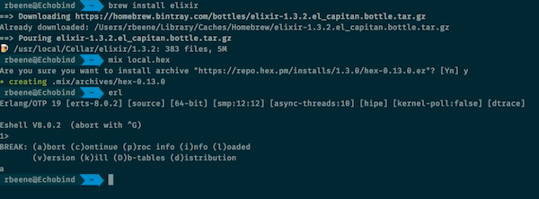
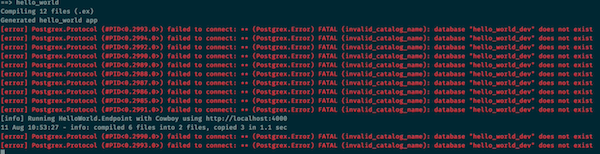
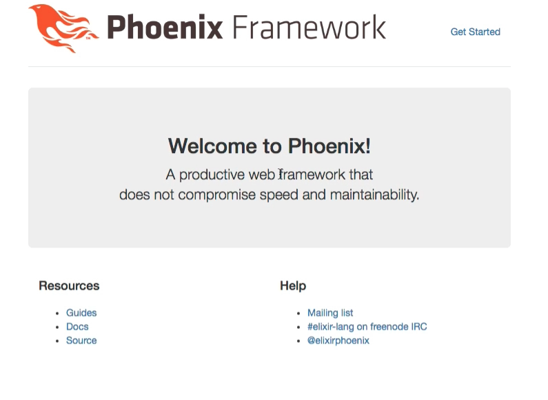

# Phoenix Dockerized
(Pulled from a blog article I wrote [here](http://echobind.com/blog))

---
title: Starting a Phoenix Project with Docker
date: 2016-08-11
tags: phoenix, docker
author: beene
---
Before I setup a new Dockerfile for a new technology stack, I like to map out how I would do this without Docker. How would I set this up if I didn't mind muddying my host OS with a given technology? READMORE



A brief word on Docker. Docker is a virtualization approach to infrastructure. Imagine being able to ensure that every developer was running the same version of each item in the technology stack. Database, redis, memcache -  any piece of the stack can be setup by a couple Docker related files. No more issues because someone developed on the wrong version of Postgres. No more wondering if you're mirroring production. You can. You can do it with Docker.

Let's do this first so we can see how we map from [local install](http://www.phoenixframework.org/docs/installation) to Docker installation.

#### Installing Phoenix

To install Phoenix, we must first have [elixir](http://elixir-lang.org/install.html). We're going to be using Ubuntu for our base image in Docker, but use the appropriate instructions for your local operating system. For OS X, the following command will do the trick if you have [homebrew](http://brew.sh/) installed.



#### OS X

```shell
brew install elixir
```

#### Ubuntu
```shell
wget https://packages.erlang-solutions.com/erlang-solutions_1.0_all.deb && sudo dpkg -i erlang-solutions_1.0_all.deb
sudo apt-get update
sudo apt-get install esl-erlang
sudo apt-get install elixir
```

Once this is installed we'll have access to the mix command.

> Mix is a build tool that ships with Elixir that provides tasks for creating, compiling, testing your application, managing its dependencies and much more.

##### Other Dependencies

We'll need to install hex (a package manager) and rebar (used to build Erlang packages)

```shell
mix local.hex
mix local.rebar
```

##### Phoenix
Finally, we can install Phoenix.

```shell
 mix archive.install https://github.com/phoenixframework/archives/raw/master/phoenix_new.ez
```

##### Hello World
We can start a new project by running the follow command to generate an app called "hello_phoenix".

```shell
 mix phoenix.new hello_phoenix
```

This will generate the basic framework of an application. At completion, you'll be prompted on whether or not to install dependencies which would run the following.

```shell
mix deps.get
```

This will also compile your assets using [Brunch.io](brunch.io) which uses npm. This means this is also a requirement if you don't specify --no-brunch when creating your application.

```shell
mix archive.install https://github.com/phoenixframework/archives/raw/master/phoenix_new.ez --no-brunch
```

For our purposes, we'll keep with the defaults and use brunch.

Finally, we'll create our database and then run our application. If you see the following, then you forgot the database creation.



```shell
mix ecto.create # database creation
mix phoenix.server
```

If all goes well, you should see the following at [http://localhost:4000].



#### Dockerize It!
Great. Now you're up and running with a local installation of Phoenix. Now how do we do that with Docker?

> Docker ensures all environments and developers are operating on the same versions of every dependency.

This article assumes you've already installed Docker for your local machine.

* [OS X](https://docs.docker.com/docker-for-mac/)
* [Windows](https://docs.docker.com/engine/installation/windows/#/docker-for-windows)
* [Linux](https://docs.docker.com/engine/installation/#/on-linux)

> No more issues because someone developed on the wrong version of Postgres. No more wondering if you're mirroring production. You can. You can do it with Docker.

Once installed, we can start building out our Dockerfile. What's a Dockerfile though?

> A Dockerfile is a text document that contains all the commands a user could call on the command line to assemble an image. Using docker build users can create an automated build that executes several command-line instructions in succession. [Reference](https://docs.docker.com/engine/reference/builder/#dockerfile-reference)

One important benefit of Docker is the ability to build off existing images. Phoenix is no different as the Elixir project has their own official base images. We'll start there.

Open a new file named 'Dockerfile' and add the following contents:

```docker
# Elixir 1.3.2.: https://hub.docker.com/_/elixir/
FROM elixir:1.3.2
```

Next, we'll want to set an environment variable that will skip post-install steps.

```docker
ENV DEBIAN_FRONTEND=noninteractive
```

##### Install hex package manager

```docker
RUN mix local.hex --force
```

##### Install rebar (Erlang build tool)

```docker
# Install rebar
RUN mix local.rebar --force
```

This should all seem very familiar. We're just continuing to add our steps that we performed locally into the Dockerfile. Think of it as a recipe of repeatable steps to ensure every one is running the same environment.

##### Install Phoenix

```docker
# Install the Phoenix framework itself
RUN mix archive.install --force https://github.com/phoenixframework/archives/raw/master/phoenix_new.ez
```

##### Install Node and NPM for Brunch

```docker
# Install NodeJS 6.x and the NPM
RUN curl -sL https://deb.nodesource.com/setup_6.x | bash -
RUN apt-get install -y -q nodejs
```

Finally, for Docker we have to specify our work directory

```docker
WORKDIR /app
ADD . /app
```

> The WORKDIR instruction sets the working directory for any RUN, CMD, ENTRYPOINT, COPY and ADD instructions that follow it in the Dockerfile. If the WORKDIR doesn’t exist, it will be created even if it’s not used in any subsequent Dockerfile instruction.

> The ADD instruction copies new files, directories or remote file URLs from <src> and adds them to the filesystem of the container at the path <dest>.

With this setup, we'll have a Docker container that has Phoenix installed and ready to go. Of course, we still need a database and to setup the initial application. This is where Docker Compose comes in.

#### Docker Compose

Docker Compose allows Docker to mix multiple images together. No modern web framework lives on its own. Docker Compose orchestrates the databases, cache layers, search...anything that you need in one package. Let's see what a simple example would look like with Phoenix.

```yml
version: '2'
services:
  db:
    image: postgres
  web:
    build: .
    command: mix phoenix.server
    volumes:
      - .:/app
    ports:
      - "4000:4000"
    depends_on:
      - db

```
If you're a Rubyist, you probably recognize this yml format.  Here's the breakdown.

Docker Compose is on its 2nd version.
Services represent the various containers that will run. We can name the next level anything we want but this will be important when the containers communicate with each other.  For example, we could have named db "postgres" instead. Image tells docker which image to use to build that container.

Web is where the interesting things happen. It is our phoenix app. To build it, we use the current directory's Dockerfile. That is why we see this line.

```yml
build: .
```

The command to run on successful launch is indicated in the "command" line.
Volumes  connects the current directory with the /app directory.
Ports maps port 4000 on localhost to port 4000 on the container.
depends_on links this container to the db. This is where the names have to match.

> **Containers must reference each other by their service name**

Now that we have this file in place, we can begin setting things in motion.

##### Build

```shell
docker-compose up -d
docker-compose run web mix phoenix.new hello_world
mv hello_world/* ./
mv hello_world/.gitignore ./
rm -rf hello_world
# don't forget to rename your database hostname, you remember this step - right?
docker-compose run web mix ecto.create
docker-compose restart web
```

> Did you get an error when creating the database? I purposefully left out a step. Remember the hostname needs to match the names of your containers. If you look inside the new phoenix application, you'll find a file `config\dev.exs`. At the bottom of this file, it gives `localhost` for the hostname of the database server. In the land of docker, we're calling it `db`. Make that change and try to create the database again.

If all goes well, go to localhost:4000.

With this setup, you can get up and running on any machine running docker and know your environment is exactly the same. In development, qa, and production - you can keep everything in lock step.

> Want to get started without typing all this out? Fork my project [here](https://github.com/rbeene/phoenix-with-docker) and give it a whirl. Just make sure you have Docker installed!
